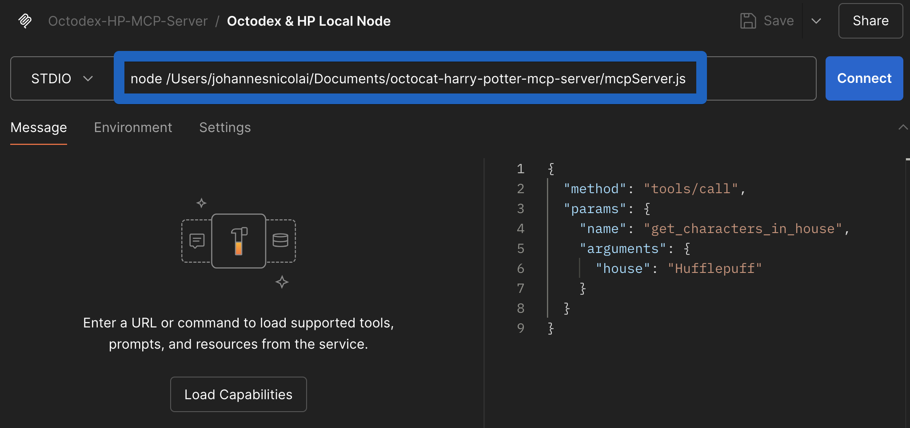

# Postman Agent Generator

Welcome to your generated agent! 🚀

This project was created with the [Postman Agent Generator](https://postman.com/explore/agent-generator), configured to [Model Context Provider (MCP)](https://modelcontextprotocol.io/introduction) Server output mode. It provides you with:

- ✅ An MCP-compatible server (`mcpServer.js`)
- ✅ Automatically generated JavaScript tools for each selected Postman API request

Let's set things up!

## 🚦 Getting Started

### ⚙️ Prerequisites

Before starting, please ensure you have:

- [Node.js (v16+ required, v20+ recommended)](https://nodejs.org/)
- [npm](https://www.npmjs.com/) (included with Node)

### 📥 Installation & Setup

**1. Install dependencies**

Run from your project's root directory:

```sh
npm install
```

### 🔐 Set tool environment variables (not needed for octocat and harry potter api)

In the `.env` file, you'll see environment variable placeholders, one for each workspace that the selected tools are from. For example, if you selected requests from 2 workspaces, e.g. Acme and Widgets, you'll see two placeholders:

```
ACME_API_KEY=
WIDGETS_API_KEY=
```

Update the values with actual API keys for each API. These environment variables are used inside of the generated tools to set the API key for each request. You can inspect a file in the `tools` directory to see how it works.

```javascript
// environment variables are used inside of each tool file
const apiKey = process.env.ACME_API_KEY;
```

**Caveat:** This may not be correct for every API. The generation logic is relatively simple - for each workspace, we create an environment variable with the same name as the workspace slug, and then use that environment variable in each tool file that belongs to that workspace. If this isn't the right behavior for your chosen API, no problem! You can manually update anything in the `.env` file or tool files to accurately reflect the API's method of authentication.

### 🛠️ List Available Tools

List descriptions and parameters from all generated tools with:

```sh
node index.js tools
```

Example:

```
Available Tools:

Workspace: 6-harry-potter-api-with-magic-visualizations
  Collection: hogwarts-staff.js
    get_hogwarts_staff
      Description: Retrieve all Hogwarts staff characters.
      Parameters:

  Collection: spells.js
    fetch_spells
      Description: Fetch spells from the Harry Potter API.
      Parameters:

  Collection: hogwarts-students.js
    get_hogwarts_students
      Description: Fetch all Hogwarts students from the Harry Potter API.
      Parameters:

  Collection: characters-in-house.js
    get_characters_in_house
      Description: Retrieve characters from a specific Hogwarts house.
      Parameters:
        - house: The name of the Hogwarts house to retrieve characters from.

  Collection: all-characters.js
    get_all_characters
      Description: Retrieve all characters from the Harry Potter API.
      Parameters:


Workspace: 7-git-hub-octodex-postbot
  Collection: build-your-own-octodex-api.js
    fetch_octocats
      Description: Fetch Octocats from the Octodex API.
      Parameters:
```

## 🌐 Running the MCP Server

The MCP Server (`mcpServer.js`) exposes your automated API tools to MCP-compatible clients, such as Claude Desktop or the Postman Desktop Application.

1. Find node path:

```sh
which node
```

2. Find `mcpServer.js` path:

```sh
realpath mcpServer.js
```

#### A) 🖥️ Run with Postman

The Postman Desktop Application is the easiest way to run and test MCP servers.

Step 1: Download the latest Postman Desktop Application from [https://www.postman.com/downloads/](https://www.postman.com/downloads/) or install the latest Postman Desktop Agent to work with Postman in your browser.

Step 2: Fork or modify the `Octodex-HP-MCP Server` Postman Collection from [here](https://www.postman.com/postman/fun-apis-only/collection/6832260ff71692b64e70f283?action=share&source=copy-link&creator=24435735) and adjust the `Octodex & HP Local Node` server settings to point to your local MCP server:




#### B) 👩‍💻 Run with Claude Desktop

To integrate with Claude Desktop:


Open Claude Desktop → **Settings** → **Developers** → **Edit Config** and add your server:

```json
{
  "mcpServers": {
    "octocat-hp-mcp-server-local": {
      "command": "<absolute_path_to_node>",
      "args": ["<absolute_path_to_mcpServer.js>"]
    }
  }
}
```

e.g.

```json
{
  "mcpServers": {
    "octocat-hp-mcp-server-local": {
      "command": "/usr/local/bin/node",
      "args": ["/Users/yourusername/octocat-harry-potter-mcp-server/mcpServer.js"]
    }
  }
}
```

Restart Claude Desktop to activate this change.

#### C) 🏃‍♂️ Run MCP Server in VSCode

In order to run the local MCP server in VSCode, you can adapt and start the [octocat-hp-mcp-server-local](.vscode/mcp.json) server in the .vscode folder.

If you then select Agent mode in Co-Pilot Chat, the tools icon should should show API endpoints (tools) exposed by the `octocat-hp-mcp-server-local` server.

### Additional Options

#### 🐳 Docker Deployment (Production)

For production deployments, you can use Docker:

**1. Build Docker image**

```sh
docker build -t octocat-hp-mcp-server .
```

Add your environment variables (API keys, etc.) inside the `.env` file.

Test it locally:

```sh
docker run -i --rm --env-file .env octocat-hp-mcp-server
```

**2. Claude Desktop Integration**

Add Docker server configuration to Claude Desktop (Settings → Developers → Edit Config):

```json
{
  "mcpServers": {
    "octocat-hp-mcp-server-docker": {
      "command": "docker",
      "args": ["run", "-i", "--rm", "--env-file=.env", "octocat-hp-mcp-server"]
    }
  }
}
```

**3. VS Code Integration**

In order to run the Docker MCP server in VSCode, you can adapt and start the [octocat-hp-mcp-server-docker](.vscode/mcp.json) server in the .vscode folder.

If you then select Agent mode in Co-Pilot Chat, the tools icon should should show API endpoints (tools) exposed by the `octocat-hp-mcp-server-docker` server.


#### 🌐 Server-Sent Events (SSE)

To run the server with Server-Sent Events (SSE) support, use the `--sse` flag:

```sh
node mcpServer.js --sse
```

**To run with SSE in Docker and expose on port 9000:**

```sh
docker run  -i --rm  -p 9000:9000 --env-file .env octocat-hp-mcp-server node mcpServer.js --sse
```

This will start the server in the background, mapping port 9000 on your host to port 9000 in the container, and enable SSE support.

## 🐳 Dockerfile (Included)

The project comes bundled with the following minimal Docker setup:

```dockerfile
FROM node:22.12-alpine AS builder

WORKDIR /app
COPY package.json package-lock.json ./
RUN npm install

COPY . .

ENTRYPOINT ["node", "mcpServer.js"]
```

## ➕ Adding New Tools

Extend your agent with more tools easily:

1. Visit [Postman Agent Generator](https://postman.com/explore/agent-generator).
2. Pick new API request(s), generate a new agent, and download it.
3. Copy new generated tool(s) into your existing project's `tools/` folder.
4. Update your `tools/paths.js` file to include new tool references.

## Example prompts and visualizations

[prompts.md](prompts.md) has some example prompts how to test the capabilities of the MCP server, which lead to [visualizations](hp_octocat_matcher.html) like this


## 💬 Questions & Support

Visit the [Postman Agent Generator](https://postman.com/explore/agent-generator) page for updates and new capabilities.

Visit the [Postman Community](https://community.postman.com/) to share what you've built, ask questions and get help.
